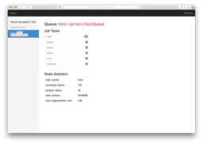
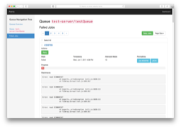

# Arena

An intuitive Web GUI for [Bull](https://github.com/optimalbits/bull). Built on Express so you can run Arena standalone, or mounted in another app as middleware.

For a quick introduction to the motivations for creating Arena, read *[Interactively monitoring Bull, a Redis-backed job queue for Node](https://www.mixmax.com/blog/introducing-bull-arena)*.

### Screenshots

[](screen1.png) [](screen2.png) [](screen3.png)

### Features

* Check the health of a queue and its jobs at a glance
* Paginate and filter jobs by their state
* View details and stacktraces of jobs with permalinks
* Restart and retry jobs with one click

### Usage

#### Prerequisites

Configure your queues in the "queues" key of [`index.json`](src/server/config/index.json). Queues take the following format:

```json
{
  "name": "my_queue",
  "port": 6381,
  "host": "127.0.0.1",
  "hostId": "AWS Server 2"
}
```

All fields are required but `hostId` can be given any name, so it is recommended to give it a helpful name for reference.

To specify a custom file location, see "Running Arena as a node module".

#### Running the server

Run `npm install` to fetch Arena's dependencies. Then run `npm start` to start the server.

Note that because Arena is dependent on `async`/`await`, Arena only currently supports Node `>7`.

#### Running Arena as a node module

Alternatively, you can use Arena as a node module. This has potential benefits:

* Arena can be configured to use any method of server/queue configuration desired
  * for example, fetching available redis queues from an AWS instance on server start
  * or even just plain old reading from environment variables
* Arena can be mounted in other express apps as middleware

Usage:

In project folder:

```
> npm install --save-dev bull-arena
```

In router.js:

```js
const express = require('express');
const router = express.Router();

const arena = require('bull-arena')({queues});
router.use('/', arena);
```

### Development

Arena is written using Express, with simple jQuery and Handlebars on the front end.

If updating dependencies, please use Yarn and update the `yarn.lock` file before submitting a pull request.

### License

The [MIT License](LICENSE).
