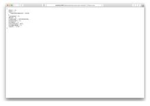

# Arena

An intuitive Web GUI for [Bee Queue](https://github.com/bee-queue/bee-queue) and [Bull](https://github.com/optimalbits/bull). Built on Express so you can run Arena standalone, or mounted in another app as middleware.

For a quick introduction to the motivations for creating Arena, read *[Interactively monitoring Bull, a Redis-backed job queue for Node](https://www.mixmax.com/blog/introducing-bull-arena)*.

### Screenshots

[](screenshots/screen1.png) [](screenshots/screen2.png) [](screenshots/screen3.png)

### Features

* Check the health of a queue and its jobs at a glance
* Paginate and filter jobs by their state
* View details and stacktraces of jobs with permalinks
* Restart and retry jobs with one click

### Usage

#### Prerequisites

Configure your queues in the "queues" key of [`index.json`](src/server/config/index.json). Queues take the following format:

```json
{
  "name": "my_queue",
  "port": 6381,
  "host": "127.0.0.1",
  "hostId": "AWS Server 2"
}
```

The `name`, `port`, `host`, and `hostId` fields are required. `hostId` can be given any name, so it is recommended to give it a helpful name for reference. 
Optionally, you can also pass in `db` and `password` to configure redis credentials, or `prefix` to specify the customized prefix of the queue.

To specify a custom file location, see "Running Arena as a node module".

*Note that if you happen to use Amazon Web Services' Elasticache as your Redis host, check out http://mixmax.com/blog/bull-queue-aws-autodiscovery*

#### Running the server

Run `npm install` to fetch Arena's dependencies. Then run `npm start` to start the server.

Note that because Arena is dependent on `async`/`await`, Arena only currently supports Node `>7`.

#### Running Arena as a node module

Alternatively, you can use Arena as a node module. This has potential benefits:

* Arena can be configured to use any method of server/queue configuration desired
  * for example, fetching available redis queues from an AWS instance on server start
  * or even just plain old reading from environment variables
* Arena can be mounted in other express apps as middleware

Usage:

In project folder:

```shell
yarn add bull-arena
```

In router.js:

```js
const Arena = require('bull-arena');

const express = require('express');
const router = express.Router();

const arena = Arena({queues});
router.use('/', arena);
```

`Arena` takes two arguments. The first, `config`, is a plain object containing the [queue configuration](#prerequisites). The second, `listenOpts`, is an object that can contain the following optional parameters:

* `port` - specify custom port to listen on (default: 4567)
* `basePath` - specify custom path to mount server on (default: '/')
* `disableListen` - don't let the server listen (useful when mounting Arena as a sub-app of another Express app) (default: false)

### Bee Queue support

Arena is dual-compatible with Bull 3.x and the [1.0.0 pre-release of bee-queue](https://github.com/bee-queue/bee-queue/pull/64). To add a Bee queue to the Arena dashboard, include the `type: bee` attribute with an individual queue's configation object.

### Docker image

You can now `docker pull` Arena from [Docker Hub](https://hub.docker.com/r/mixmaxhq/arena/).

To build the image simply run:

```shell
docker build -t <name-image> .
```

To run a container, execute the following command. Note that we need to settle the location of `index.json` in this container via volume mounting:

```shell
docker run -p 4567:4567 -v </local/route/to/index.json>:/opt/arena/src/server/config/index.json <name-image>
```

### Development

Arena is written using Express, with simple jQuery and Handlebars on the front end.

If updating dependencies, please use Yarn and update the `yarn.lock` file before submitting a pull request.

### License

The [MIT License](LICENSE).
